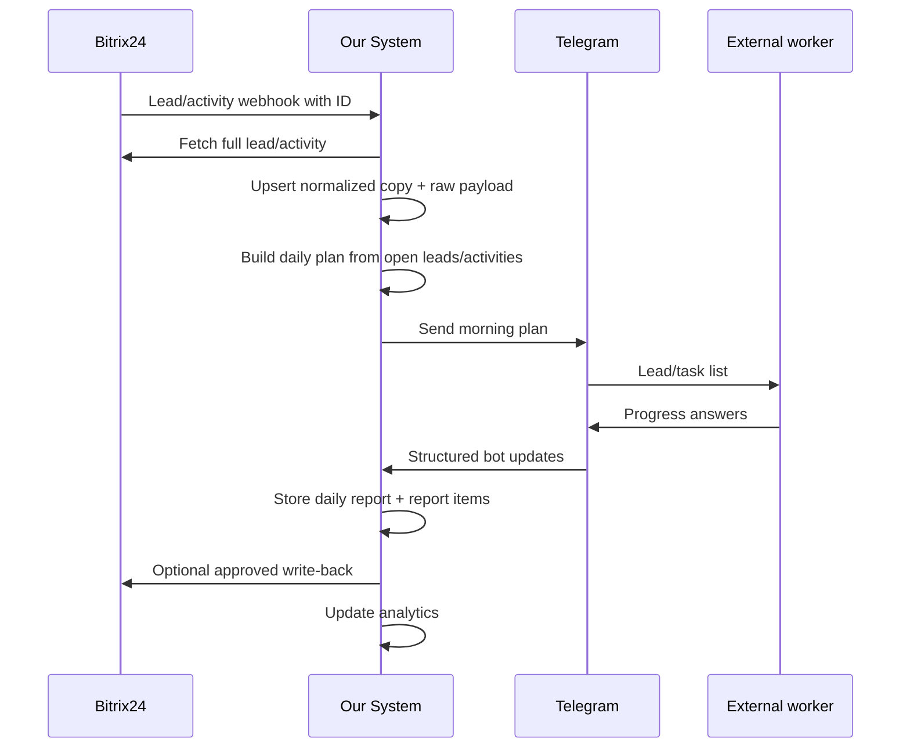

# LeadOps MVP Workflow

## Primary Flow

## Morning Plan

Generated once per workday per active external worker.

Inputs:

- Open leads assigned to the worker or mapped Bitrix responsible user.
- Activities due today.
- Overdue activities.
- Leads without next activity.
- Leads blocked by previous evening reports.

Telegram output:

- Lead title.
- Stage name.
- Next activity/deadline.
- Contact summary if allowed.
- Action buttons: `In progress`, `Done`, `Blocked`, `Postpone`, `Comment`.

## Evening Report

Collected once per workday per active external worker.

Questions:

- Which planned items were completed?
- Which items were postponed?
- Which items are blocked?
- What next action is needed?
- Should a manager be alerted?
- What comment should be stored internally or written back to Bitrix24?

## MVP Analytics

Initial dashboards should answer:

- How many leads are in each stage?
- Which leads have overdue activities?
- Which leads have no next activity?
- Which workers did not send evening reports?
- Which workers have the highest blocked/postponed item count?
- How stale is the local CRM snapshot?

## MVP Non-Goals

- Full Bitrix24 replacement.
- Arbitrary CRM editing from Telegram.
- Complex routing/assignment engine.
- Multi-messenger abstraction beyond keeping names extensible.
- Production-grade queue infrastructure before the first working scenario.
